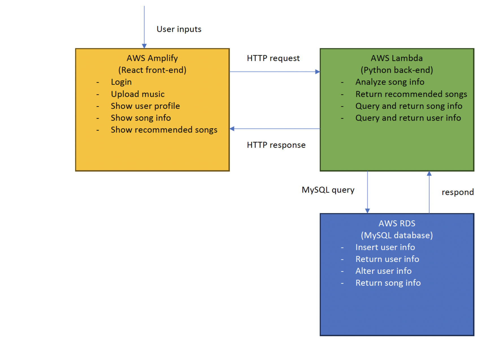

# group-project-readme

### Introduction

- #### Motivation   
    We build this website because there is no existing websites where users can upload a sound file and analyze its genre. Normal websites can only support searching a song in the database and analyze its genre. Therefore when users want to know the genre of a specific song, they are limited to songs in the database of the website. There are recommendation systems provided by music platforms like Spotify, but they only recommend songs based on genre and artists. Our recommendation system focus on finding songs with similar audio characteristics. Our website also support recommending similar songs according to user upload, which is also new.

- ##### Functionalities
  
  Here is a list of all the implemented functionalities:

  - Upload & analyze
  - Search
  - Browse songs by genre
  - Create account and login
  - History
  - Recommendation
  - Music preferences

For more details about our project, please view the [full project proposal](/Team21_Proposal%20Final.pdf.pdf).

### Technical architecture


- #### Front-end
  - Read and process user inputs
  - Request and receive data from backend
  - Present data to users
  - Language: JavaScript
  - Libraries: React, Ant Design
  - Contributors: Xinming Zhai, David Fu
- #### Back-end
  - Train genre-prediction model
  - Recommend songs from dataset
  - Manage requests from front-end and respond with data
  - Create queries to database
  - Language: Python
  - Libraries: Pandas, PyTorch, Scikit-Learn, Numpy, Librosa, MySQL-Connector
  - Contributors: Aoyang Li, Zhuoang Tao

- #### Database
  - Store data about users and songs
  - Process queries from backend and return query results
  - Language: SQL
  - Contributor: David Fu

### Installation Instructions

Our website is hosted on AWS. You can directly access our website in this [link](https://main.d4taukhpvxu3q.amplifyapp.com/home).

You can also run the code locally with
```
npm install
npm start
```
and see the website on `http://localhost:3000/`.

### Team members
- Aoyang Li
  
  Find datasets and train genre prediction models, and write recommendation system.
- David Fu
  
  Implement front-end and database, deploy front-end/back-end on AWS.
- Xinming Zhai
  
  Design front-end UI and implement front-end functionalities
- Zhuoang Tao
  
  Find music audio dataset and obtain music features dataset. Train and test music prediction model.
